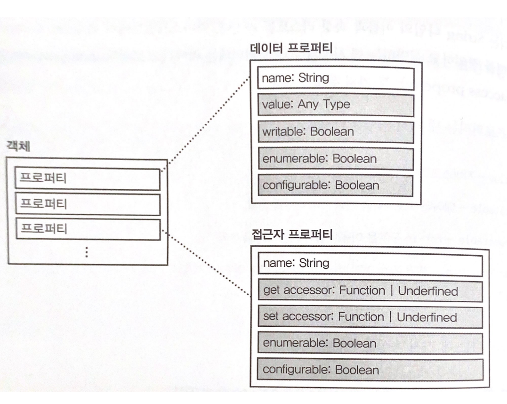

# 프로퍼티

## 프로퍼티란?
- 자바스크립트에서 객체는 논리적으로 프로퍼티의 집합이다. 
- 프로퍼티는 String 타입의 이름과 속성 리스트를 가진다.
- 속성(attributes)은 프로퍼티의 상태를 정의하고 설명하는데 사용된다. 

## 프로퍼티의 종료

### 데이터 프로퍼티(data property)
#### 속성
- value : 모든 자료형 지정 가능
 - writable : 변경 가능여부
 - enumerable : for-in 구문을 이용해 열거 가능 여부
 - configurable : 제거 가능 여부, 접근 프로퍼티 변경 가능 여부, 쓰기 불가 여부, enumerable 속성의 수정 가능 여부
 
### 접근 프로퍼티(access property)
#### 속성
- get accessor : Function or undefined
- set accessor : Function or undefined
 - enumerable : for-in 구문을 이용해 열거 가능 여부
 - configurable : 제거 가능 여부, 데이터 프로퍼티 변경 가능 여부, 다른 속성들의 수정 가능 여부

## 프로퍼티의 수정

Object.defineProperty 또는 Object.defineProperties를 사용해 수정이 가능하다.

[[jsfiddle](https://jsfiddle.net/itjeon/0e1ysurv/)]
````
function  User(name, department){
	var  _department = department;
	var  _name = name;
	
	Object.defineProperty(this, 'name', {
		value:  _name,
		writable:  true,
		enumerable:  true,
		configurable:  false
	});
	
	Object.defineProperty(this, 'department', {
		get:  function(){
			console.log('Retrieving department');
			return  _department;
		},
		set:  function(newValue){
			console.log('Updating department value to "' + newValue + '"');
			_department = newValue;
		},
		enumerable:  true,
		configurable:  true
	});
	Object.defineProperty(this, 'greeting', {
		value:  function(){
			console.log('Hi, I\'m ' + _name + '.');
		},
		enumerable:  false,
		configurable:  false
	});
}

var  user = new  User('Sunny', 'Engineering');
console.log(user.department);
user.department = 'Marketing';
user.greeting();

// configurable: false 이므로 오류발생
// Object.defineProperty(user, 'name', {
// 	enumerable:false
// }); 

// configurable: false 이므로 삭제 안됨
delete  user.name; 

// configurable: true 삭제
delete  user.department; 

// name만 출력됨, department는 삭제, greeting는 enumerable: false
for(var  prop  in  user){
	console.log(prop); 
}
````



### [<-Main](https://github.com/itjeon/javascript)
